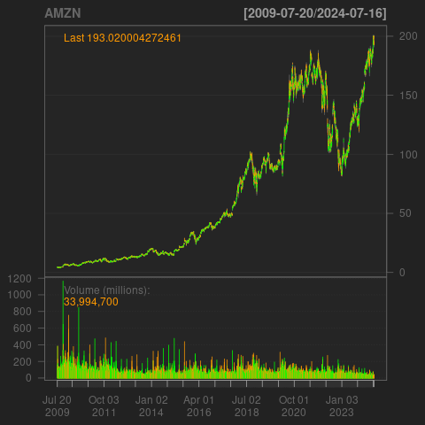
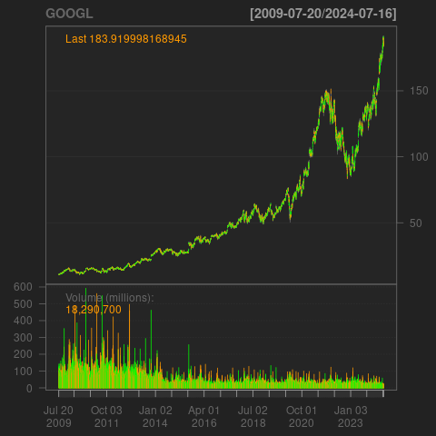
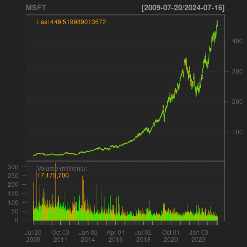

<head>
  <script src="https://polyfill.io/v3/polyfill.min.js?features=es6"></script>
  <script id="MathJax-script" async src="https://cdn.jsdelivr.net/npm/mathjax@3/es5/tex-mml-chtml.js"></script>
</head>

# Financial Econometrics 

**Author**: Olasubomi Precious Odujebe  
**Date**: August 2024  

## Introduction
This project involves forming a 3-stock portfolio using Microsoft (MSFT), Amazon (AMZN), and Google (GOOGL). The goal is to analyze the daily price series of these stocks over the past 15 years, test for stationarity, and calculate their monthly returns. A multivariate GARCH-DCC model is then applied to estimate dynamic correlations between the stocks’ returns.

The project further explores the use of the model's results to forecast expected returns and the variance-covariance matrix for the portfolio. Finally, the assignment uses the forecasted data to optimize a Sharpe Ratio-maximizing portfolio without short-selling. Through this process, investors can gain insights into how the stocks’ volatilities and correlations change over time and apply these findings to portfolio management.

## Data Collection
```r
# Set time frame -- 2009-2024
date_from = as.Date("2009-07-18")
date_to = as.Date("2024-07-17")

# Download data for 3 stocks
getSymbols('MSFT', from = date_from, to = date_to)
getSymbols('AMZN', from = date_from, to = date_to)
getSymbols('GOOGL', from = date_from, to = date_to)

# Plot daily price series
chartSeries(MSFT)
chartSeries(AMZN)
chartSeries(GOOGL)
```




1.  **Microsoft (MSFT):**

-   Microsoft's stock price has shown a consistent upward trend over the past 15 years, increasing from around \$20 in 2009 to over \$400 in 2024. This indicates a strong performance and growth trajectory for the company's shares.

-   The stock exhibits periods of volatility, particularly during market downturns and economic events, the overall trend remains positive. This means that despite fluctuations, the general direction of the stock price is upwards.

-   Trading volume for MSFT shows peaks and troughs, with significant spikes during high trading activity periods. These spikes may coincide with earnings announcements or other major company events that attract increased investor interest.

2.  **Amazon (AMZN)**:

-   Amazon's stock price has also demonstrated a significant upward trend, rising from around \$100 in 2009 to over \$190 in 2024. The growth trajectory of AMZN shares is slightly more volatile compared to Microsoft, with noticeable corrections along the way.

-   AMZN has experienced periods of high volatility, especially during events like the 2020 COVID-19 pandemic, reflecting both market conditions and company-specific factors. This volatility can impact the stock price.

-   The trading volume for Amazon is notably high, with substantial spikes coinciding with major company events such as earnings reports, product launches, and other market-moving news. This indicates a high level of investor interest and activity in AMZN shares.

3.  **Google (GOOGL)**:

-   Google's stock price follows a similar upward trend, growing from approximately \$100 in 2009 to around \$180 in 2024. The growth of GOOGL shares is consistent, with occasional periods of correction and consolidation.

-   Like the other companies, Google also experiences periods of increased volatility, especially during broader market downturns and specific company-related news. These fluctuations can impact the stock's performance.

-   Trading volume for Google indicates periods of high activity, typically aligned with significant announcements like earnings releases, regulatory news, and other impactful events related to the company. This shows that there is active trading interest in GOOGL shares during these periods.


## ADF Test Results for Monthly Returns
The Augmented Dickey-Fuller (ADF) test was applied to the monthly returns of Microsoft (MSFT), Amazon (AMZN), and Google (GOOGL) to assess whether the return series are stationary. The null hypothesis for the ADF test is that the series contains a unit root, meaning it is non-stationary.

```r
# Calculate monthly returns
mr_MSFT <- monthlyReturn(MSFT)
mr_AMZN <- monthlyReturn(AMZN)
mr_GOOGL <- monthlyReturn(GOOGL)

# Combine monthly return series into a single data frame
dataA3 <- merge(mr_MSFT, mr_AMZN, mr_GOOGL)
names(dataA3) <- c("mr_MSFT", "mr_AMZN", "mr_GOOGL")
```
```{r 
# Conduct ADF test on the monthly returns
adf_test_returns_MSFT <- adf.test(mr_MSFT, alternative = "stationary")
adf_test_returns_AMZN <- adf.test(mr_AMZN, alternative = "stationary")
adf_test_returns_GOOGL <- adf.test(mr_GOOGL, alternative = "stationary")
```
**Results**:

- **Microsoft (MSFT)**:
  - Dickey-Fuller Statistic: -6.5914
  - p-value: 0.01
  - **Conclusion**: The p-value is less than 0.05, so we reject the null hypothesis. The monthly returns for Microsoft are stationary.

- **Amazon (AMZN)**:
  - Dickey-Fuller Statistic: -5.607
  - p-value: 0.01
  - **Conclusion**: The p-value is less than 0.05, so we reject the null hypothesis. The monthly returns for Amazon are stationary.

- **Google (GOOGL)**:
  - Dickey-Fuller Statistic: -5.7593
  - p-value: 0.01
  - **Conclusion**: The p-value is less than 0.05, so we reject the null hypothesis. The monthly returns for Google are stationary.

**Interpretation**:
The results indicate that the monthly returns for MSFT, AMZN, and GOOGL are stationary, as the null hypothesis of a unit root is rejected for all three stocks. This suggests that the monthly returns do not follow a trend over time and are mean-reverting.


## Multivariate GARCH-DCC Model

In this section, a multivariate GARCH-DCC (Dynamic Conditional Correlation) model is applied to the monthly returns of Microsoft (MSFT), Amazon (AMZN), and Google (GOOGL). This approach allows us to model the volatility of each stock and capture the dynamic correlations between them over time.

**Model Setup**

The GARCH-DCC model is implemented in two stages:
1. Fit a univariate GARCH(1,1) model for each of the three stock returns to capture individual volatilities.
2. Apply the DCC model to estimate the time-varying correlations between the stocks' returns.

The following R code is used to run the GARCH-DCC model:

```r
# GARCH-DCC model setup
uspec = ugarchspec(mean.model = list(armaOrder = c(0,0)), 
                   variance.model = list(garchOrder = c(1,1), model = "sGARCH"), 
                   distribution.model = "norm")

# DCC model specification
spec1 = dccspec(uspec = multispec( replicate(3, uspec) ), dccOrder = c(1,1), distribution = "mvnorm")

# Fit the model to the data
fit1 = dccfit(spec1, data = dataA3, fit.control = list(eval.se=T))

# Display the fitted model output
fit1
```

**Model Summary**

- The model used a **multivariate normal distribution** with DCC(1,1) specification.
- It estimated **17 parameters** for 3 series with **181 observations**.
- The log-likelihood was **730.6125**, with an average log-likelihood of **4.04**.

**Optimal Parameters**

- **Mean Returns (μ)**:
  - **MSFT**: 0.018158 (significant)
  - **AMZN**: 0.025006 (significant)
  - **GOOGL**: 0.018943 (significant)

- **GARCH Parameters**:
  - For MSFT, AMZN, and GOOGL, the **omega** and **alpha1** parameters were not significant.
  - The **beta1** parameters were highly significant, indicating high persistence in volatility for all three stocks.  

- **DCC Parameters**:
  - The **dcca1** parameter (0.036429) was not significant.
  - The **dccb1** parameter (0.824507) was highly significant, suggesting strong persistence in dynamic correlations.

**Key Insights**

1. **Mean Returns**:  
   All three stocks have **positive** and **statistically significant** mean returns, indicating positive expected monthly returns.

2. **Volatility Persistence (GARCH Parameters)**:  
   - **MSFT** and **AMZN** exhibit **high persistence** in volatility, while **GOOGL** shows moderate persistence.
   - Immediate shocks to volatility, as indicated by the **alpha1** parameters, were not significant for any of the three stocks.

3. **Dynamic Conditional Correlation (DCC) Parameters**:  
   - **Strong persistence** in dynamic correlations was observed, with the **dccb1** parameter highly significant.
   - **Lagged correlations** have a limited immediate effect on current correlations, as indicated by the non-significant **dcca1** parameter.

** Model Fit:** The model demonstrated a **good fit** to the data, supported by the **high log-likelihood** and **low information criteria** values, indicating a strong ability to capture the dynamics of the stock returns and their correlations.


## Forecasting Expected Returns and Variance-Covariance Matrix

Based on the estimation results from the GARCH-DCC model, we can forecast the expected returns and the variance-covariance matrix for Microsoft (MSFT), Amazon (AMZN), and Google (GOOGL) for the next period.

** 1. Forecasting Expected Returns** (μ)

The forecasted mean returns for the three stocks are directly obtained from the model’s estimated parameters. These represent the expected returns for the next period based on historical data:

- **Microsoft (MSFT)**: 0.018158 (1.82% per month)
- **Amazon (AMZN)**: 0.025006 (2.50% per month)
- **Google (GOOGL)**: 0.018943 (1.89% per month)

These expected returns indicate the predicted monthly performance of each stock, which can be used by investors for portfolio optimization and return forecasts.

** 2. Forecasting the Variance-Covariance Matrix**

To forecast the variance-covariance matrix, we model both the individual stock volatilities and the dynamic correlations between the stocks.

**Modeling Conditional Variances:**
The conditional variances (volatility) for each stock are modeled using the GARCH(1,1) specification, which incorporates the previously estimated GARCH parameters  $$\omega_{i}$$, $$\alpha_{i}$$, and $$\beta_{i}$$ for each stock:

$\sigma^2_{i,t+1} = \omega_i + \alpha_i \epsilon^2_{i,t} + \beta_i \sigma^2_{i,t}$
Where:
- $\omega_{i}$: GARCH model constant for stock \(i\)
- $\alpha_i$: Effect of past shocks on volatility
- $\beta_{i}$: Persistence of past volatility
- $\sigma^2_{i,t}$: Conditional variance (volatility) of stock \(i\) at time \(t\)

** Modeling Dynamic Conditional Correlations:**
The DCC(1,1) model parameters (\(dcca1\) and \(dccb1\)) are used to estimate the time-varying correlations between the stocks. This captures how correlations between the stocks change over time:

$Q_{t+1} = (1 - dcca1 - dccb1) \bar{Q} + dcca1 \epsilon_t \epsilon'_t + dccb1 Q_t$

Where:
- $\bar{Q}$: Unconditional correlation matrix (the long-run average correlation between the stocks)
- $Q_{t}$ : Current conditional correlation matrix (correlation at time \(t\))
- \(dcca1\): Coefficient for the impact of recent shocks to the correlation.
- \(dccb1\): Coefficient representing the persistence of past correlations.
- $\epsilon_t$: Vector of residuals at time \(t\).
- $\epsilon'_t$: Transpose of the vector of residuals at time \(t\).

**Deriving the Forecasted Variance-Covariance Matrix:**
The final step is to combine the forecasted individual volatilities and dynamic correlations to derive the variance-covariance matrix. This is done using the following formula:

$$\Sigma_{t+1} = D_{t+1} Q_{t+1} D_{t+1}$$

Where:
- $\Sigma_{t+1}$: Forecasted variance-covariance matrix for the next period
- $D_{t+1}$: Diagonal matrix containing the square roots of the forecasted conditional variances for each stock

**Summary:**
The DCC-GARCH model is a powerful tool that provides forecasts of both expected returns and the evolving relationships between the volatilities and correlations of the stocks. These insights are invaluable for investors looking to enhance their portfolio management by accounting for dynamic risks and return structures.
By forecasting the variance-covariance matrix, investors can better understand how the risks of individual assets interact and adjust their portfolios accordingly to optimize returns while managing risk.

## One-Month Forecasts for Returns and Variance-Covariance Matrix

Using the GARCH-DCC model, we can forecast the expected returns, variance-covariance matrix, and the correlation matrix for Microsoft (MSFT), Amazon (AMZN), and Google (GOOGL) for the next month. Below are the results:

```{r}
# 1-month forecasts
forecasts <- dccforecast(fit1, n.ahead = 1)
# conditional variance-covariance forecasts
forecasts@mforecast$H
# conditional correlation forecasts
forecasts@mforecast$R
# conditional mean forecasts
forecasts@mforecast$mu
```

### Forecasted Variance-Covariance Matrix

|         | MSFT         | AMZN         | GOOGL        |
|---------|--------------|--------------|--------------|
| **MSFT**| 0.003681961  | 0.002856862  | 0.002021071  |
| **AMZN**| 0.002856862  | 0.007913629  | 0.003021210  |
| **GOOGL**| 0.002021071  | 0.003021210  | 0.004398361  |

This table shows the forecasted variances for Microsoft (MSFT), Amazon (AMZN), and Google (GOOGL), along with the covariances between each pair of stocks for the next month.
he forecasted variances and covariances of the monthly returns for MSFT, AMZN, and GOOGL provide insights into the relationships between these stocks.

-   Variance:
-   MSFT Variance: 0.003681961
-   AMZN Variance: 0.007913629
-   GOOGL Variance: 0.004398361

-   The variances show that AMZN has the highest volatility among the three stocks, followed by GOOGL and then MSFT.
-   The covariance between MSFT and AMZN is positive (0.002856862), indicating that the returns of these two stocks tend to move together, showing a positive relationship in their movements.

Understanding the variances and covariances of these stocks is crucial for portfolio management, risk assessment, and diversification strategies. Analyzing these metrics helps investors make informed decisions about their investment choices and risk exposures based on the relationships between different assets in their portfolios.

### Forecasted Correlation Matrix

|         | MSFT         | AMZN         | GOOGL        |
|---------|--------------|--------------|--------------|
| **MSFT**| 1.0000000    | 0.5292511    | 0.5022229    |
| **AMZN**| 0.5292511    | 1.0000000    | 0.5120916    |
| **GOOGL**| 0.5022229    | 0.5120916    | 1.0000000    |

This table shows the forecasted correlation between the returns of Microsoft (MSFT), Amazon (AMZN), and Google (GOOGL) for the next month. The values represent the strength and direction of the relationships between the stock returns, with values closer to 1 indicating a stronger positive correlation.

- MSFT and AMZN Correlation: 0.5292511
- MSFT and GOOGL Correlation: 0.5022229
- AMZN and GOOGL Correlation: 0.5120916

## Sharpe Ratio-Maximizing Portfolio for the Next Month

Using the forecasted returns and variance-covariance matrix from the GARCH-DCC model, we can construct an optimal portfolio of Microsoft (MSFT), Amazon (AMZN), and Google (GOOGL) that maximizes the Sharpe Ratio for the next month, without allowing short-selling.

**Methodology**

1. **Data Collection**:
   - **Forecasted mean monthly returns** for the three stocks: MSFT, AMZN, GOOGL.
   - **Forecasted variance-covariance matrix** of the monthly returns.
   - **Monthly risk-free rate**.

2. **Objective**:
   The Sharpe Ratio is defined as:
   $SR = \frac{E(r_p) - r_f}{\sigma_p}$
   Where:
   - $E(r_p)$ is the expected return of the portfolio.
   - $r_f$ is the risk-free rate of return.
   - $\sigma_p$ is the standard deviation of the portfolio's returns.

3. **Constraints**:
   - The sum of the portfolio weights must equal 1 (fully invested portfolio).
   - All portfolio weights must be non-negative (no short-selling allowed).

4. **Optimization**:
   The objective is to maximize the Sharpe Ratio by adjusting the portfolio weights, while ensuring the sum of the weights equals 1 and all weights are non-negative.

**Results**

The following optimal portfolio weights were obtained using the forecasted returns and risk data:

- **MSFT**: 63.39%
- **AMZN**: 18.68%
- **GOOGL**: 17.92%

**Interpretation**

The optimal portfolio assigns the highest weight to **MSFT** (63.39%), followed by **AMZN** (18.68%) and **GOOGL** (17.92%). This allocation reflects the balance between the expected returns and the risk (variance and covariance) of each stock, aiming to maximize the Sharpe Ratio.

**Portfolio Metrics**

- Expected Portfolio Return $(E(ret))$:
 $E(ret) = 0.01957801 \text{ or 1.9578% per month}$

- Portfolio Variance:
 $\text{Variance} = 0.003235571$

- Portfolio Standard Deviation $\sigma_p$:
  $\sigma_p = \sqrt{0.003235571} \simeq 0.0569$

- **Sharpe Ratio**:
  $SR = 0.284413126$

### Explanation of Portfolio Optimization Results

1. **Portfolio Return**:
   - The optimized portfolio's expected return is **1.9578% per month**. This is calculated as a weighted average of the forecasted returns for MSFT, AMZN, and GOOGL.

2. **Portfolio Variance**:
   - The portfolio's variance is **0.003235571**, reflecting the dispersion or volatility of returns. This indicates the level of risk associated with the portfolio.

3. **Portfolio Standard Deviation**:
   - The portfolio's standard deviation is **0.0569**, providing an intuitive measure of risk (volatility).

4. **Sharpe Ratio**:
   - The Sharpe Ratio of the optimized portfolio is **0.284413126**. This represents the risk-adjusted return, showing how much excess return the portfolio is expected to generate per unit of risk (standard deviation). A higher Sharpe Ratio indicates a better risk-return tradeoff.

### Summary

By using Excel Solver to optimize the portfolio, the optimal weights for MSFT, AMZN, and GOOGL were determined to maximize the Sharpe Ratio. The results suggest a higher allocation to MSFT, with smaller weights for AMZN and GOOGL. The portfolio is expected to generate an **average return of 1.9578% per month**, with a **variance of 0.003235571** and a **Sharpe Ratio of 0.284413126**. This allocation reflects a balanced approach to achieving higher returns while managing risk within the portfolio.
